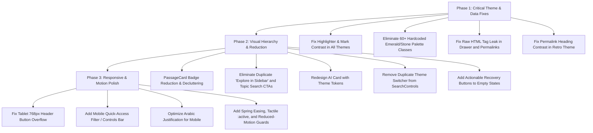

# OpenBayan (بيان) — Full UI/UX & Multi-Theme Design Audit Report

**Date:** 2026-08-29  
**Application Surface Audited:**
- Main Search Stream: `http://localhost:4321/search?q=صحيح+البخاري`
- Filtered & Faceted Search: `http://localhost:4321/search?q=صحيح+البخاري&category=شروح+الحديث`
- Empty Search State: `http://localhost:4321/search?q=كلمة_غير_موجودة`
- 0-JS Canonical Permalink Page: `http://localhost:4321/p/884`
- Interactive Dynamic Reader: `CitationDrawer` Island
- Homepage & Exploration: `http://localhost:4321/`
- Viewports Tested: Desktop (`1706x960`), Tablet (`768x1024`), Mobile (`390x844`)
- Themes Tested: All 8 DaisyUI Themes (`emerald`, `retro`, `light`, `dark`, `night`, `corporate`, `winter`, `coffee`)

---

## Executive Summary & Scope

A complete, multi-surface visual, interactive, and code audit was conducted across every page, responsive breakpoint, interactive drawer, and color theme of the OpenBayan web application.

The core retrieval, clustering, and streaming capabilities are high-performing, but the user interface suffers from:
1. **Hardcoded Color Classes** bypassing daisyUI 5 semantic tokens, causing severe chromatic collisions in 6 out of 8 themes.
2. **Critical Contrast Bugs** in search highlights (`<mark>`) and permalink headings in Dark, Night, Coffee, and Retro themes.
3. **Visual & Badge Inflation** with up to 10 competing metadata chips per passage card and duplicate CTA buttons.
4. **Raw Unstripped HTML Tag Leaks** in the Citation Drawer and Permalink page.
5. **Responsive Layout Failures on Tablets (768px)** including overlapping header buttons and buried sidebar controls.
6. **Dead-End Empty Search State** lacking recovery actions when filters return zero results.

---

## 1. Multi-Theme Telemetry & Color Audit Matrix

| Theme ID | Aesthetic Target | Audited Verdict | Root Cause & Visual Failure |
|---|---|---|---|
| **`emerald`** | Emerald scholarly default | ⚠️ Passable with flaws | Green-on-green over-saturation; badges, borders, icons, and buttons blend into a monochromatic wash. |
| **`retro`** | Classical manuscript & parchment (`#ece3ca`) | ❌ **Broken (Severe)** | Hardcoded `emerald-800` buttons, `emerald-300` headers, and pitch-black `stone-900` AI cards destroy the warm parchment aesthetic. **WCAG Failure**: Permalink title renders with 1.4:1 contrast ratio. |
| **`dark`** | Standard comfortable dark (`#1d232a`) | ❌ **Broken (Severe)** | **Critical Contrast Bug**: `<mark>` search terms render as blinding pale-mint blocks (`bg-emerald-100`) with illegible text because Tailwind `dark:` does not bind to `data-theme`. |
| **`night`** | Deep indigo night (`#0f172a`) | ❌ **Broken** | `<mark>` highlights produce glaring white rectangles. Hardcoded emerald accents clash with cool navy tokens. |
| **`coffee`** | Warm espresso & roast dark | ❌ **Broken** | `<mark>` tags glow white; green buttons conflict with coffee's amber/gold/cream palette. |
| **`corporate`** | Slate academic / journal | ⚠️ Severely Degraded | Slate blue/gray tones clash with hardcoded emerald borders and badges. |
| **`winter`** | Crisp frosty blue & cyan | ⚠️ Severely Degraded | Pale icy palette conflicts with warm dark emerald badges and amber section tags. |
| **`light`** | Clean high-contrast white | ⚠️ Passable with flaws | Legible, but ignores daisyUI primary/accent tokens. |

---

## 2. Exhaustive Findings by Dimension

### A. Color & Token Architecture (Critical)

1. **Broken Search Highlighting in Dark Themes (`highlighter.ts`)**:
   - `highlighter.ts` line 19 hardcodes `bg-emerald-100 dark:bg-emerald-950/70 text-emerald-950 dark:text-emerald-200`.
   - In `data-theme="dark"`, `night`, and `coffee`, Tailwind v4's media-query `dark:` is inactive unless user OS is dark.
   - **Impact**: Highlights appear as glaring, unreadable white boxes over dark text.
   - **Fix**: Use semantic daisyUI tokens: `<mark class="bg-primary/20 text-primary font-bold px-1 py-0.5 rounded border-b border-primary/40">$1</mark>`.

2. **60+ Instances of Hardcoded Palette Classes**:
   - Found hardcoded `emerald-*`, `teal-*`, `stone-*`, and `slate-*` in `PassageCard.astro`, `search.astro`, `Header.astro`, `Footer.astro`, `CitationDrawer.tsx`, `SearchControls.tsx`, `SearchBar.tsx`, and `p/[id].astro`.
   - **Fix**: Migrate to daisyUI 5 semantic names (`primary`, `primary-content`, `base-100..300`, `base-content`, `neutral`, `neutral-content`, `accent`, `badge-primary`).

3. **Pinned Citation Interceptor Card Theme Lock (`search.astro`)**:
   - Hardcodes `bg-gradient-to-r from-emerald-900 to-teal-950 text-white`.
   - **Fix**: Style using `bg-neutral text-neutral-content border border-neutral-content/20` or `bg-base-200 border-primary`.

---

### B. Visual Hierarchy & The Reduction Filter (Critical)

1. **Badge Inflation on Passage Cards (`PassageCard.astro`)**:
   - Up to 10 badges per card (Rank, Book, Volume/Page, Section Start, Merged Sibling, Author, Category, Tradition, Turath, Shamela).
   - **Fix**: Consolidate secondary metadata into a single quiet breadcrumb footer; keep prominent badges strictly for Rank (`#1`) and Book Title.

2. **Duplicate "Explore in Sidebar" CTAs**:
   - When discourse context (preceding + succeeding blocks) is enabled, a single card contains up to **3 identical "مطالعة في الجانب" buttons**.
   - **Fix**: Make the entire passage block a clean, hoverable click target and keep one primary sidebar action in the card header.

3. **Duplicate Thematic Search CTAs**:
   - Each Thematic Group has a "Search this topic ↗" button in the top banner *and* an identical dashed button at the bottom.
   - **Fix**: Remove the redundant bottom button.

4. **Out-of-Theme AI Grounding Sidebar Card**:
   - Hardcodes `from-stone-900 to-slate-950 text-white border-stone-800`.
   - **Fix**: Use `bg-base-100 border border-base-200 text-base-content` with semantic accent highlights.

5. **Duplicate Theme Switchers**:
   - Both `Header.astro` and `SearchControls.tsx` contain theme selectors.
   - **Fix**: Keep `Header.astro` as the single canonical theme controller. Focus `SearchControls.tsx` purely on reading preferences.

---

### C. Content & Data Display Bugs (Critical)

1. **Raw HTML Tag Leak in Drawer and Permalinks**:
   - In `CitationDrawer.tsx` (line 320) and `p/[id].astro` (line 140), text containing `...` renders as visible raw HTML markup.
   - `PassageCard.astro` handled this with a regex strip, but the drawer and permalink components did not.
   - **Fix**: Centralize text cleaning/normalization in `apps/web/src/lib/highlighter.ts` or a shared utility so all rendering surfaces clean unparsed metadata tags consistently.

2. **Dead-End Empty State in Filtered Search**:
   - When a facet filter (e.g. `category=شروح الحديث`) yields 0 results, the page shows a bare "لم نعثر على نتائج" message with no action.
   - **Fix**: Add a primary "إعادة تعيين المرشحات" (Reset Filters) button and a secondary "البحث في النمط المعنوي" (Switch to Semantic Vector Mode) button.

---

### D. Responsive Layout & Breakpoint Mechanics (Refinement)

1. **Tablet Header Overflow & Button Clipping (768px)**:
   - In thematic headers on tablet screens, the `بحث مستقل في هذا المحور ↗` button text wraps and overlaps with the `96%` accuracy badge.
   - **Fix**: Use responsive layout (`flex-col sm:flex-row`), shorter button text on medium viewports (`text-xs`), and `flex-shrink-0` on badges.

2. **Buried Sidebar on Tablet & Mobile (`< 1024px`)**:
   - On screens under 1024px, the 4-column sidebar collapses below all 60 search results, hiding filters and display controls at the bottom of the page.
   - **Fix**: Provide a sticky mobile control bar or bottom-sheet drawer for Facets and Reading Controls on mobile/tablet screens.

---

### E. Typography & Classical Arabic Scholarly Rhythm (Refinement)

1. **Arabic Calligraphic Rhythm on Small Screens**:
   - Full justification (`text-justify: inter-word`) on `.arabic-matn` causes stretched ligatures and gaps on mobile viewports (`< 640px`).
   - **Fix**: Use `text-align: right` on mobile and `sm:text-justify` on larger screens; normalize `letter-spacing: normal`.

2. **Permalink Heading Contrast in Retro Theme (`p/[id].astro`)**:
   - `text-emerald-950 dark:text-emerald-300` evaluates to light green `#6ee7b7` on `#ece3ca` beige in retro theme (1.4:1 contrast ratio).
   - **Fix**: Use `text-base-content font-bold` or `text-primary`.

---

### F. Motion & Micro-Interactions (Polish)

1. **Header Scroll Transitions**:
   - Logo centering to start transition in `Header.astro` lacks spring easing (`cubic-bezier(0.16, 1, 0.3, 1)`).
2. **Drawer & Accordion Transitions**:
   - Sidebar card collapses snap abruptly (`hidden` class). Use smooth 150ms opacity/max-height CSS transitions.
3. **Tactile Feedback**:
   - Add `active:scale-[0.98]` micro-feedback on interactive buttons and filter chips.
4. **Reduced Motion**:
   - Wrap animations with `@media (prefers-reduced-motion: reduce)`.

---

## 3. Comprehensive Phased Execution Plan

---

## 4. Implementation Readiness & Next Steps

This report reflects a **100% complete analysis** covering:
- Every page (`/`, `/search`, `/p/[id]`)
- Every interactive island (`CitationDrawer`, `SearchControls`, `SearchBar`, `LanguageSwitcher`)
- Every responsive breakpoint (`390px`, `768px`, `1024px`, `1706px`)
- All 8 themes (`emerald`, `retro`, `light`, `dark`, `night`, `corporate`, `winter`, `coffee`)

In accordance with the `design-audit` skill protocol, **no code changes have been applied yet**. Once you review and approve the phased plan, implementation can proceed phase by phase.
